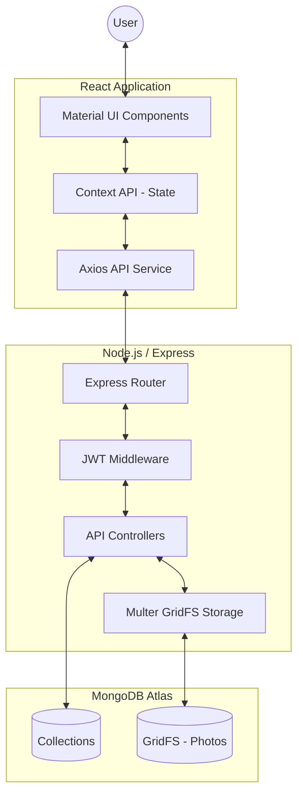

# Low-Level Design (LLD): EduVoyage

EduVoyage is a comprehensive blogging platform designed for students and alumni to share experiences, insights, and study tips. This document details the technical implementation, architectural decisions, and data structures of the application.

## 1. System Architecture

The application follows the **MERN** stack architecture (MongoDB, Express, React, Node.js).

## 2. Low-Level Components

### 2.1 Backend (Node.js/Express)

- **Entry Point (`index.js`)**: Initializes the Express server, sets up middleware (CORS, Body-parser), and connects to MongoDB.
- **Middleware**:
    - `authenticateToken`: Validates the JWT stored in the request's Authorization header.
- **File Handling**: Uses `multer-gridfs-storage` to stream images directly into MongoDB's GridFS.

### 2.2 Database Models (MongoDB/Mongoose)

| Model | Fields | Description |
| :--- | :--- | :--- |
| **User** | `name`, `username`, `password` (hashed) | Stores user identity and credentials. |
| **Post** | `title`, `description`, `picture`, `username`, `categories`, `createdDate` | Stores blog post content and metadata. |
| **Comment** | `name`, `postId`, `date`, `comments` | Stores user comments linked to specific posts. |
| **Token** | `token` | Stores refresh tokens for session management. |

### 2.3 API Endpoints

#### Authentication
- `POST /login`: Authenticates user, returns Access Token (JWT) and Refresh Token.
- `POST /signup`: Hashes password using Bcrypt and saves a new user.
- `POST /logout`: Removes the refresh token from the database.
- `POST /token`: Generates a new Access Token using a Refresh Token.

#### Blog Management
- `POST /create`: Creates a new post (Authenticated).
- `PUT /update/:id`: Updates an existing post by ID (Authenticated).
- `DELETE /delete/:id`: Deletes a post by ID (Authenticated).
- `GET /post/:id`: Fetches a single post by ID.
- `GET /posts`: Fetches all posts, supports filtering by category.

#### Comments
- `POST /comment/new`: Adds a new comment to a post.
- `GET /comments/:id`: Fetches all comments for a specific post.
- `DELETE /comment/delete/:id`: Removes a comment.

#### File Storage
- `POST /file/upload`: Uploads an image to GridFS and returns the file URL.
- `GET /file/:filename`: Streams an image from GridFS.

## 3. Frontend Architecture (React)

### 3.1 State Management
- **Context API (`DataProvider`)**: Manages the global `account` state (username and name) across the application.

### 3.2 Component Hierarchy
- `App.js`: Routing using `react-router-dom`. Implement `PrivateRoute` for protected content.
- `Header`: Navigation bar.
- `Home`: Dashboard showing the blog feed and category filters.
- `DetailView`: Full blog post viewing with comment section.
- `CreatePost` / `Update`: Forms for contributing content.
- `Login`: Authentication landing page.

### 3.3 API Service (`src/service/api.js`)
- Uses **Axios Interceptors** to:
    - Automatically attach the `AccessToken` to every outgoing request.
    - Handle global error messaging and response parsing.

## 4. Key Workflows

### 4.1 Post Creation Workflow
1. User selects/uploads an image.
2. `POST /file/upload` sends image to GridFS; returns file URL.
3. User fills in post details.
4. `POST /create` saves the post document with the file URL in the `picture` field.

### 4.2 Authentication Workflow
1. User submits credentials.
2. Backend validates with Bcrypt and signs two JWTs:
   - `accessToken`: Short-lived (60m).
   - `refreshToken`: Long-lived, stored in the `Token` collection.
3. Tokens are returned to the client and stored in `sessionStorage`.

## 5. Security Details
- **Password Security**: Bcrypt hashing with a salt factor of 10.
- **Authorization**: Access tokens are required for all mutation operations (create, update, delete).
- **Environment Variables**: Sensitive data like DB credentials and JWT secrets are stored in `.env`.
